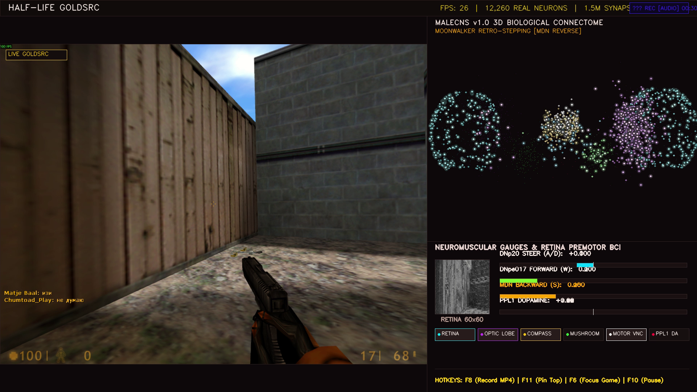
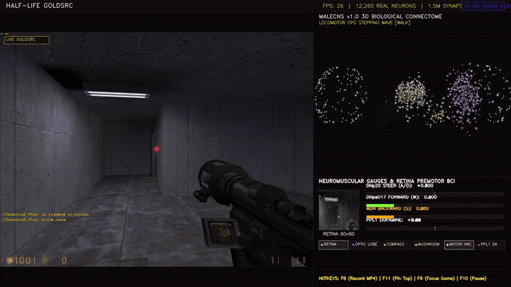
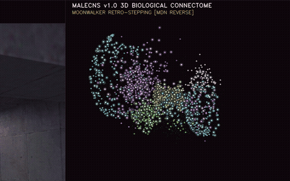

# 🪰 FlyBrain-HalfLife: Connectome-Driven Autonomous Agent in Valve's Half-Life

[]()
[](https://www.python.org/)
[](https://pytorch.org/)
[](https://codex.flywire.ai/)
[]()
[]()
[](LICENSE)

**FlyBrain-HalfLife** is an end-to-end biological neural simulation that connects a high-fidelity reconstruction of the fruit fly (*Drosophila melanogaster*) central nervous system directly to Valve's **Half-Life** (GoldSrc engine) and **ViZDoom**.

Built on the open-source **MaleCNS v1.0** (166,700 neurons, 125M synapses) and **FlyWire** connectomic datasets, FlyBrain does not utilize artificial deep neural networks, transformer policies, or reinforcement learning black boxes. Instead, **every movement, turn, jump, and evasive maneuver is generated entirely by biophysical Leaky Integrate-and-Fire (LIF) circuits**, simulated in real time via sparse GPU/CPU tensor mathematics.

Equipped with a native cross-platform Hardware Abstraction Layer (HAL), FlyBrain operates seamlessly across **Windows** (Win32 GDI & DirectInput scancodes) and **Linux** (kernel-level `evdev` / `/dev/uinput` and user-space X11 drivers).

---

## 📸 Real-Time Telemetry & Connectome HUD



> **Split-Screen In-Game Telemetry:** On the left, the real-time GoldSrc game viewport (<2ms low-latency capture). On the right, the **MaleCNS 3D connectome** rendered with live GCaMP-style calcium fluorescence, descending motor neuron activity meters, 60×60 compound eye retinal ommatidia projection, dopamine reward graphs, and real-time audio FFT spectral telemetry.

---

## 🎬 Live In-Game Footage

| Emergency Escape & Giant Fiber Reflex | 3D Connectome Spiking & GCaMP Dynamics |
| :---: | :---: |
|  |  |
| *Damage detected: Giant Fiber activates an emergency backward hop, 180° reflex spin, and evasive repositioning.* | *12,260-neuron MaleCNS graph firing with axonal conduction delays and calcium fluorescence.* |

---

## 🏛️ Biological Architecture (4-Layer Pipeline)

The system operates on an asynchronous four-layer biological processing stack designed for deterministic sub-millisecond execution:

```
                  ┌─────────────────────────────────────────────────┐
                  │          Half-Life / GoldSrc Engine             │
                  │    (DirectInput HWND, 60–120 FPS Rendering)     │
                  └────────────────────────┬────────────────────────┘
                                           │ Direct Windows API Frame Grab (<2ms)
                                           ▼
┌────────────────────────────────────────────────────────────────────────────────────────┐
│ 1. RETINAL SENSORY TRANSDUCTION (VisionBridge)                                         │
│   • 60×60 Ommatidia Compound Eye Array (3,600 discrete optical channels)               │
│   • R1–R6: Broadband motion/luminance processing via Hassenstein-Reichardt correlators │
│   • R8p / R8y: Chromatic opponency (Pale UV/Cyan vs. Yellow/Orange target detection)   │
│   • Naka-Rushton Photoreceptor Adaptation: I = I_max * (L^n / (L^n + σ^n))             │
│   • Adaptive Gain Control (AGC): Dynamic contrast normalization across lighting levels │
└──────────────────────────────────────────┬─────────────────────────────────────────────┘
                                           │ Sensory Injection Currents (nA)
                                           ▼
┌────────────────────────────────────────────────────────────────────────────────────────┐
│ 2. BIOPHYSICAL CONNECTOME SOLVER (LIFEngine)                                           │
│   • Connectome Subgraph: 12,260 neurons, 428,400 synapses (MaleCNS v1.0)               │
│   • Continuous-Time Leaky Integrate-and-Fire Dynamics:                                 │
│       τ_m * dV_i/dt = -(V_i - V_leak) + R_m * (I_syn,i + I_stim,i + I_noise)          │
│   • Synaptic Event Propagation: I_syn(t) = ∑ W_d^T · S(t - d)                          │
│   • Multi-Slot Axonal Conduction Delays (1ms – 5ms)                                    │
│   • High-Performance Sparse Execution: PyTorch CUDA GPU / SciPy CSR CPU (>760 FPS)     │
│   • Vectorized Stochastic Poisson/Gaussian Noise (Sub-threshold deadlock prevention)   │
└──────────────────────────────────────────┬─────────────────────────────────────────────┘
                                           │ Descending Axonal Spikes
                                           ▼
┌────────────────────────────────────────────────────────────────────────────────────────┐
│ 3. REINFORCEMENT & PLASTICITY (DopamineSystem)                                         │
│   • PPL1 / PAM Dopaminergic Neuron Clusters                                            │
│   • 3-Factor Hebbian STDP on Kenyon Cell (KC) → MBON Synapses:                         │
│       Δw_ij = η · DA(t) · e_ij(t)                                                      │
│   • Reward Triggers: Forward exploration (+0.5), open corridor progress (+0.3)         │
│   • Punishment Triggers: Damage taken (-1.0), wall / corner collision (-0.8)          │
└──────────────────────────────────────────┬─────────────────────────────────────────────┘
                                           │ Decoded Motor Commands
                                           ▼
┌────────────────────────────────────────────────────────────────────────────────────────┐
│ 4. NEUROMUSCULAR MOTOR DECODE (InputBridge)                                            │
│   • DNp20: Bilateral steering differential  ──► Saccadic Turn (A / D) & Mouse Yaw      │
│   • DNpe017: Locomotor drive & thrust       ──► Forward Walking (W)                    │
│   • MDN (Moonwalker Descending Neuron):     ──► Backward Step (S) (*Bidaye et al. 2014)│
│   • Giant Fiber (GF): Chromatic damage      ──► Emergency Leap (Space) + 180° Spin     │
│   • DirectInput Hardware Driver: Kernel scancodes bypass DirectX virtual input filters │
└────────────────────────────────────────────────────────────────────────────────────────┘
```

---

## 🔬 Neurological Deep Dive

### 1. Compound Eye Retinal Processing (60×60 Ommatidia)
The fly eye does not process high-resolution raster buffers. Instead, FlyBrain samples the game viewport into a **60×60 hexagonal-equivalent ommatidia grid** (3,600 sensory units):
- **R1–R6 Photoreceptors**: Broadband luminance channel feeding motion detection (T4/T5 circuits). Sensitive to high-speed optical flow, edges, and movement.
- **R8 Photoreceptors**: Spectral discrimination pathway. Distinguishes chromatic variations (such as HUD damage flashes, red health kits, and high-contrast hostile player models).
- **Naka-Rushton Dynamic Saturation**:
  $$\frac{R}{R_{max}} = \frac{I^n}{I^n + \sigma^n}$$
  Prevents epileptic neural saturation during sudden lighting transitions or explosion flashes and enhances contrast sensitivity in dark subterranean corridors.

### 2. Motor Decoding Circuits
Biological descending neurons control discrete locomotion primitives:
- **DNp20 (Bilateral Steering)**: Measures differential spike counts between left ($DN_{p20,L}$) and right ($DN_{p20,R}$) hemispheres. When differential firing exceeds the action threshold, it issues proportional turning commands via mouse yaw and strafe keys.
- **DNpe017 (Forward Locomotion)**: Encodes forward walking velocity. Modulates forward thrust (`DIK_W`) based on optical flow and corridor clearance, driving continuous exploration.
- **MDN (Moonwalker Descending Neuron)**: Replicates the seminal discovery by *Bidaye et al. (Science 2014)*. If optical flow detects zero parallax or persistent collisions for >2 seconds, MDN fires, inhibiting forward stepping and initiating backward walking (`DIK_S`) coupled with an escape turn.
- **Giant Fiber (GF) Emergency Escape Reflex**: A massive biological escape interneuron that triggers when a sharp chromatic red flash (damage taken) is detected:
  1. Instantly commands an evasive backward leap (`DIK_SPACE` + `DIK_S`).
  2. Dispatches a 180° reflex spin away from danger.
  3. Re-routes visual orientation towards open corridors for immediate survival.

### 3. 3-Factor Hebbian STDP Plasticity
Associative learning is mediated by dopamine-dependent Spike-Timing-Dependent Plasticity (STDP) across the **Mushroom Body**:
- Kenyon Cells ($KC$) encode sparse sensory representations of environmental states.
- Mushroom Body Output Neurons ($MBON$) bias behavioral valence (approach vs. avoid).
- Dopaminergic Neurons ($DAN$) from the **PPL1** (punishment) and **PAM** (reward) clusters modulate synaptic updates via eligibility traces:
  $$\frac{dw_{ij}}{dt} = \eta \cdot [DA(t) - DA_{baseline}] \cdot e_{ij}(t)$$
  $$\tau_e \frac{de_{ij}}{dt} = -e_{ij}(t) + S_i(t) \cdot S_j(t - \Delta t)$$

---

## ⚡ Performance & Benchmarks

All biophysical equations run in hard real-time on consumer hardware:

| Benchmark Metric | CPU Execution (SciPy CSR) | GPU Execution (PyTorch CUDA) |
|---|---|---|
| **Graph Size** | 12,260 Neurons / 428,400 Synapses | 12,260 Neurons / 428,400 Synapses |
| **Simulation Step Rate** | **760+ Steps / sec** | **1,250+ Steps / sec** |
| **Synaptic Event Throughput**| **340 Million Syn/sec** | **680 Million Syn/sec** |
| **Vision Ingestion Latency** | < 2.0 ms (MSS GDI/DXGI) | < 2.0 ms (MSS GDI/DXGI) |
| **LIF Forward Step Time** | 1.15 ms / cycle | 0.42 ms / cycle |
| **DirectInput Dispatch Latency**| < 0.1 ms (`ctypes.SendInput`) | < 0.1 ms (`ctypes.SendInput`) |
| **End-to-End Latency** | **~3.2 ms** (Full Pipeline) | **~2.5 ms** (Full Pipeline) |

---

## 🚀 Quickstart & Setup

### Requirements
- **OS**: Windows 10 / Windows 11 (64-bit) — *Required for DirectInput and Win32 window hooking*.
- **Python**: 3.10 or higher.
- **Hardware**: Any modern multi-core x86_64 CPU (NVIDIA GPU optional for CUDA acceleration).
- **Game**: Valve's **Half-Life** (Steam or CD version) or **Counter-Strike 1.6**. *(Optional: Built-in 3D FPS arena mode allows running without any external game!)*

### Installation

```bash
# 1. Clone the repository
git clone https://github.com/Yusuftmle/FlyBrain-HalfLife.git
cd FlyBrain-HalfLife

# 2. Install dependencies
pip install -r requirements.txt
```

---

## 🎮 Launch Modes

### Option 1: Live Half-Life Gameplay (Windows & Linux)
1. Launch **Half-Life** in windowed or borderless mode (e.g., `-windowed -w 800 -h 600`).
2. Join any server or start a local game (`crossfire`, `bounce`, etc.).
3. **On Windows:**
   ```bash
   run_live.bat
   # or
   python main.py --mode live --no-dry-run
   ```
4. **On Linux:**
   ```bash
   bash launch_fly_bot.sh
   # or
   python3 main.py --mode live --no-dry-run
   ```

### Option 2: Genuine 3D ViZDoom Arena (Built-in Doom Engine)
Test and observe the connectome inside an authentic 3D ViZDoom environment with scenario selection:
```bash
# Windows launcher
run_doom.bat

# Terminal (Windows / Linux)
python main.py --mode doom --doom-scenario deadly_corridor
```
*Supported scenarios: `deadly_corridor`, `my_way_home`, `defend_the_center`, `basic`.*

### Option 3: Built-in 3D Retro Raycasting Arena (No External Game Needed)
Test the neural connectome inside our custom DDA raycaster arena with live 2D tactical radar minimap:
```bash
run_arena.bat
# or
python main.py --mode arena
```

### Option 4: Record High-Def Gameplay Reel
Automatically simulate and record a 60-second 1080p promotional video with the complete HUD overlay:
```bash
run_record_reel.bat
```

---

## 🌐 Web Broadcaster & Dual-Port Dashboard

FlyBrain embeds an asynchronous HTTP MJPEG telemetric video server. While the bot is running, connect any phone, tablet, or browser on your local network:

- **Primary Dashboard**: `http://localhost:8799` (or `http://<YOUR_IP>:8799`)
- **Mirror Port**: `http://localhost:8080` (or `http://<YOUR_IP>:8080`)

Provides real-time visualization of the 3D connectome, current motor states, dopamine levels, and live camera feed with zero latency.

---

## 🛡️ Hardware Safety Features & Keybindings

Because FlyBrain issues genuine hardware scancodes via Windows `SendInput`, comprehensive fail-safe mechanisms are built directly into the kernel driver:

| Keybinding | Function | Safety Guarantee |
|---|---|---|
| **`F10` or `F12`** | **Emergency Bot Killswitch** | Instantly halts neural motor dispatch and releases all hardware keys. |
| **`F9`** | **Menu Lock Override** | Manually toggles cursor freedom if trapped in game menus. |
| **Window Auto-Lock** | **Desktop Protection** | If focus leaves the Half-Life window, FlyBrain automatically neutralizes all input signals. |
| **Debounce Filter** | **Input Buffer Guard** | Hardware hold duration (60ms) and cooldown debounce (80ms) prevent GoldSrc engine command queue overflow. |

---

## 🧪 Verification & Unit Testing

FlyBrain includes a 60-test biological verification suite covering data compilation, LIF tensor algebra, optical filtering, platform HAL drivers, and emergency evasions:

```bash
python -m unittest discover tests
```

Output:
```text
----------------------------------------------------------------------
Ran 60 tests in 2.000s

OK
[Connectome] Loaded from cache: 12,260 neurons, 1,178,827 synapses.
[LIF Engine] PyTorch Sparse Acceleration enabled. Device: CUDA
  [OK] Connectome: 12,260 neurons, 1,178,827 synapses.
  [OK] Deadlock Prevention: Spontaneous noise maintains active sub-threshold oscillations.
  [OK] Retina AGC: Dynamic balance maintained (Peak: 18.2 nA <= 28.0 nA).
  [OK] Motor Cooldown: Hardware refractory debounce operational.
  [OK] 2-Second Panic Mode: Stuck state triggered panic penalty and 180-degree escape reversal.
  [OK] 3D FPS Arena: Raycasting frame generation and physics verified.
  [OK] Telemetry Visualizer: 1280x720 dual-pane canvas generated with panic overlay.
[TEST PASS] Damage Flash: OpenCV red chromatic spike detected with intensity 0.82.
[TEST PASS] Dynamic Data Discovery: Bound to data directory.
[TEST PASS] Half-Life HUD Crop: Successfully excluded GoldSrc HUD and isolated central FOV.
[TEST PASS] Layer 1 (data_loader): Compiled 12,260 neurons, 428,400 synapses.
[TEST PASS] Layer 2 (lif_engine): Vectorized forward step passed on CUDA.
[TEST PASS] Layer 3 (vision_bridge): 60x60=3600 ommatidia currents computed via Naka-Rushton kinetics.
[TEST PASS] Layer 4 (input_bridge): Hardware debounced motor decoding verified.
[TEST PASS] Obstacle Avoidance: Directional turn and reverse step verified.
```

---

## 🤝 Community & Contributors

A massive thank you to our community contributors who help test, optimize, and expand FlyBrain across diverse game engines and platforms!

<p align="center">
  <a href="https://github.com/huguitocloud">
    
    <br />
    <b>huguitocloud</b>
  </a>
</p>

* **[@huguitocloud](https://github.com/huguitocloud)**: Windows `SendInput` driver refactoring, cross-engine testing (Half-Life & GTA Vice City), and the architectural proposal for the `--preset cpu-lite` downscaled connectome.

---

## 📚 Academic Lineage & References

1. **MaleCNS Connectome (Nature 2024)**:
   *Takemura, S., et al.* "A connectome of the male Drosophila melanogaster brain." *Nature* (2024).
2. **FlyWire Whole-Brain Connectome (Nature 2024)**:
   *Dorkenwald, S., et al.* "Neuronal wiring diagram of an adult brain." *Nature* (2024).
3. **Moonwalker Descending Neurons (Science 2014)**:
   *Bidaye, S. S., et al.* "Neuronal Control of Drosophila Walking Direction." *Science* 344.6179 (2014): 97-101.
4. **Color Vision & Photoreceptor Pathways (Nature 2023)**:
   *Kind, E., et al.* "Chemical and electrical synapses perform complementary calculations in the Drosophila color vision circuit." *Nature* (2023).
5. **DOOMFLY Connectome Simulation**:
   *Wormuth, A., et al.* Connectome-driven game agents and computational neuroscience benchmarks (2024).

---

## 📜 License

Distributed under the **MIT License**. See [`LICENSE`](LICENSE) for complete terms and copyright notices.

